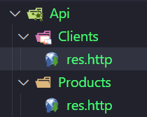

https://pemweb2.test/ (ini untuk membuka di chrome)

➜  pemweb2 git:(main) dcm Product
➜  pemweb2 git:(main) ✗ dcm Client

isi migration :

prodicts:

<?php

use Illuminate\Database\Migrations\Migration;
use Illuminate\Database\Schema\Blueprint;
use Illuminate\Support\Facades\Schema;

return new class extends Migration
{
    /**
     * Run the migrations.
     */
    public function up(): void
    {
        Schema::create('products', function (Blueprint $table) {
            $table->id();
            $table->stringid('name');
            $table->decimal('price', 10, 2);
            $table->timestamps();
        });
    }

    /**
     * Reverse the migrations.
     */
    public function down(): void
    {
        Schema::dropIfExists('products');
    }
};

clients:

<?php

use Illuminate\Database\Migrations\Migration;
use Illuminate\Database\Schema\Blueprint;
use Illuminate\Support\Facades\Schema;

return new class extends Migration
{
    /**
     * Run the migrations.
     */
    public function up(): void
    {
        Schema::create('clients', function (Blueprint $table) {
            $table->id();
            $table->stringid('name');
            $table->timestamps();
        });
    }

    /**
     * Reverse the migrations.
     */
    public function down(): void
    {
        Schema::dropIfExists('clients');
    }
};

isi bagian seeders:

clien:

<?php

namespace Database\Seeders;

use App\Models\Client;
use Illuminate\Database\Console\Seeds\WithoutModelEvents;
use Illuminate\Database\Seeder;

class ClientSeeder extends Seeder
{
    /**
     * Run the database seeds.
     */
    public function run(): void
    {
        Client::firstOrCreate([
            'name' => 'Default Client',
        ]);
    }
}

product:

<?php

namespace Database\Seeders;

use App\Models\Product;
use Illuminate\Database\Console\Seeds\WithoutModelEvents;
use Illuminate\Database\Seeder;

class ProductSeeder extends Seeder
{
    /**
     * Run the database seeds.
     */
    public function run(): void
    {
        Product::firstOrCreate([
            'name' => 'Default Product',
            'price' => 1.00,
        ]);
    }
}

app/models:

client:

<?php

namespace App\Models;

use Illuminate\Database\Eloquent\Model;

class Client extends Model
{
    protected $fillable = [
        'name',
    ];
}

product:

<?php

namespace App\Models;

use Illuminate\Database\Eloquent\Model;

class Product extends Model
{
    protected $fillable = [
        'name',
        'price',
    ];
}

sudah dan lanjut api,masuk ke app/http/controler/

claientcontroller.php:

<?php

namespace App\Http\Controllers;

use Illuminate\Http\Request;

class ClientController extends Controller
{
    public function index()
    {
        $data = Client::all();
        return response()->json([
            'massage' => 'List of Clients',
            'data' => $data
        ], 200);
    }
}

masuk ke routes api.php:

<?php

use Illuminate\Support\Facades\Route;

Route:: prefix('products')->group (function () {
   Route::get('/',[ProductController::class, 'index'])->name('product')
});

Route:: prefix('clients')->group (function () {
    Route::get('/',[ClientController::class, 'index'])->name('client')
 });

masuk ke chrome /api/clients

lanjut install extenstation: rest client

bikin folder di luar src

client:
@baseUrl = https://pemweb2.test/api/clients

@cType = application/json

### Get all products

GET {{baseUrl}}/products
Content-Type: {{cType}}

cara ke 2
masuk ke postman

cara ke 3:

## saya edit di bagian client deskripsinya:

migration
seeders
models

AKU ALFIN
